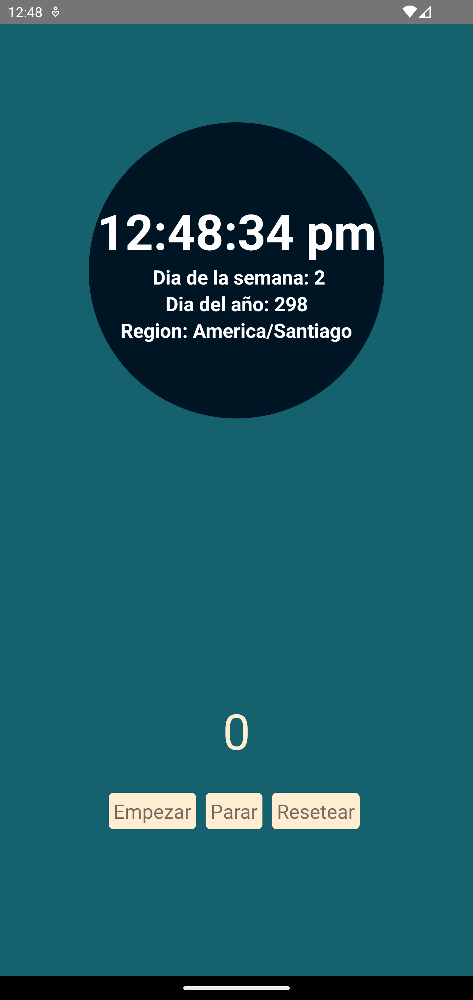

# Clock App 

Esta es mi primera aplicacion con React-native y Typescript, fue hecha para una prueba tecnica en la que se tenia que desarrollar
un reloj funcional consumiendo una API del tiempo, la cual ofrecia diferente informacion acerca del pais

De igual forma se integro un cronometro sencillo usando Hooks en React de forma sencilla para empezar, detener y resetear el cronometro

# Para correr la app

Necesitas clonar este repositorio y abrirlo en tu editor de codigo de preferencia, luego abrir la consola y correr el comando npm install
siguiendo estos pasos necesitas abrir un emulador de Android como el que te ofrece Android Studio, y luego en la consola del proyecto correr el siguiente comando npx react-native run-android y podras ver la app en tu emulador.

Espero que sea de guia este repositorio y que disfrutes de correr la app (: 

## Clock img

    

